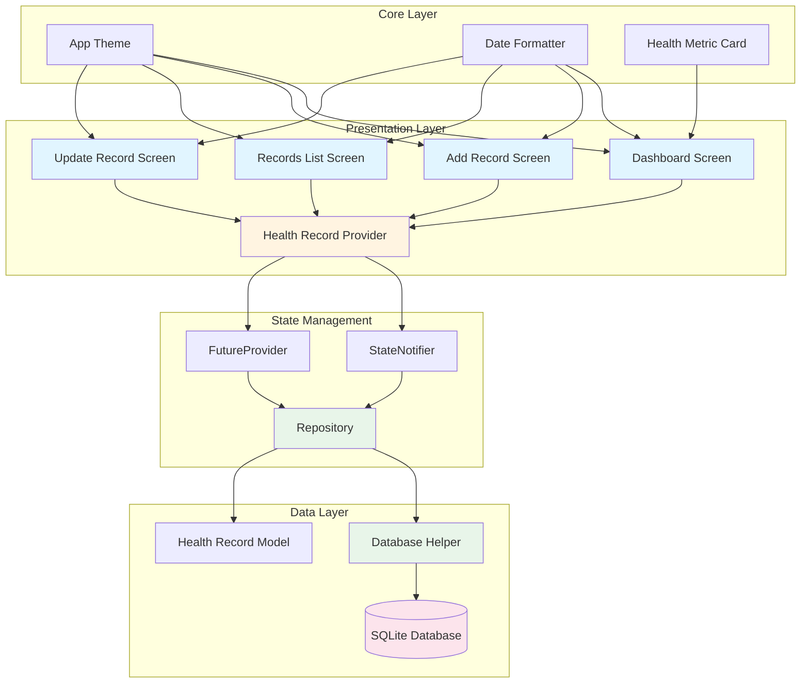
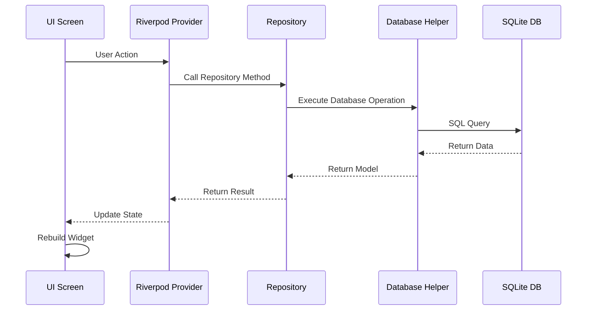
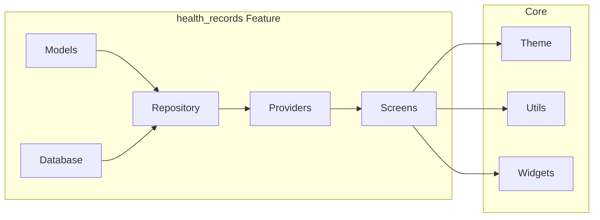
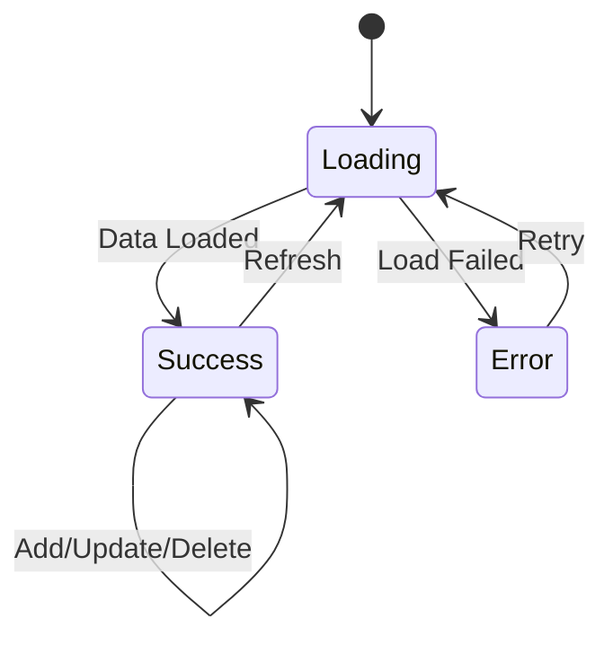
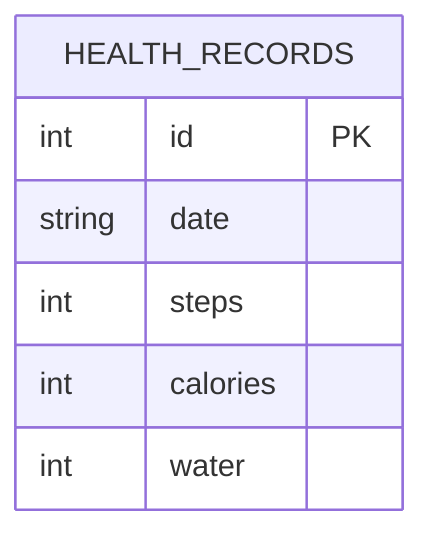

# HealthMate Architecture Diagram

## System Architecture

```mermaid
graph TB
    subgraph "Presentation Layer"
        A[Dashboard Screen] --> B[Health Record Provider]
        C[Add Record Screen] --> B
        D[Records List Screen] --> B
        E[Update Record Screen] --> B
    end
    
    subgraph "State Management"
        B --> F[StateNotifier]
        B --> G[FutureProvider]
        F --> H[Repository]
        G --> H
    end
    
    subgraph "Data Layer"
        H --> I[Database Helper]
        I --> J[(SQLite Database)]
        H --> K[Health Record Model]
    end
    
    subgraph "Core Layer"
        L[App Theme] --> A
        L --> C
        L --> D
        L --> E
        M[Date Formatter] --> A
        M --> C
        M --> D
        M --> E
        N[Health Metric Card] --> A
    end
    
    style A fill:#e1f5ff
    style C fill:#e1f5ff
    style D fill:#e1f5ff
    style E fill:#e1f5ff
    style B fill:#fff4e1
    style H fill:#e8f5e9
    style I fill:#e8f5e9
    style J fill:#fce4ec
```

## Data Flow

```mermaid
sequenceDiagram
    participant UI as UI Screen
    participant Provider as Riverpod Provider
    participant Repo as Repository
    participant DB as Database Helper
    participant SQLite as SQLite DB
    
    UI->>Provider: User Action
    Provider->>Repo: Call Repository Method
    Repo->>DB: Execute Database Operation
    DB->>SQLite: SQL Query
    SQLite-->>DB: Return Data
    DB-->>Repo: Return Model
    Repo-->>Provider: Return Result
    Provider-->>UI: Update State
    UI->>UI: Rebuild Widget
```

## Feature Module Structure

```mermaid
graph LR
    subgraph "health_records Feature"
        A[Models] --> B[Repository]
        B --> C[Providers]
        C --> D[Screens]
        E[Database] --> B
    end
    
    subgraph "Core"
        F[Theme]
        G[Utils]
        H[Widgets]
    end
    
    D --> F
    D --> G
    D --> H
```

## State Management Flow

```mermaid
stateDiagram-v2
    [*] --> Loading
    Loading --> Success: Data Loaded
    Loading --> Error: Load Failed
    Success --> Loading: Refresh
    Error --> Loading: Retry
    Success --> Success: Add/Update/Delete
```

## Database Schema

```mermaid
erDiagram
    HEALTH_RECORDS {
        int id PK
        string date
        int steps
        int calories
        int water
    }
```

